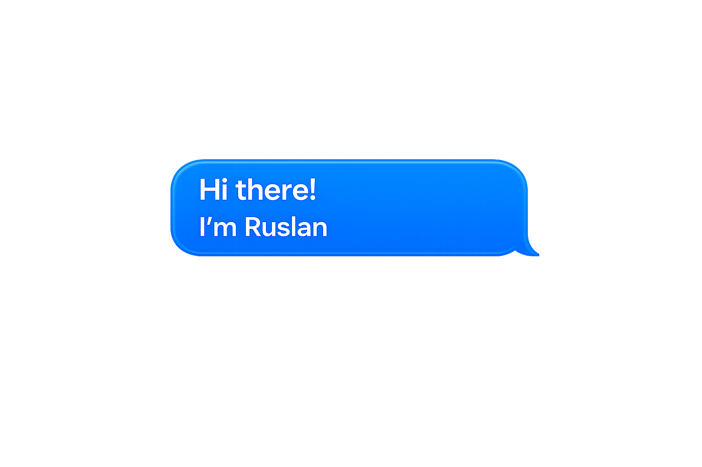

  <h2 align="center">🛠 Tech Stack</h2>
  

    
    &nbsp;&nbsp;&nbsp;
    
    &nbsp;&nbsp;&nbsp;
    
    &nbsp;&nbsp;&nbsp;
    
     &nbsp;&nbsp;&nbsp;
    
     &nbsp;&nbsp;&nbsp;
    
      
  

  
  
  <h2 align="center">📊 GitHub Stats</h2>
  

    

      
      
    

     
    
  

  
   
  
  <h2 align="center">🔗 My contacts</h2>
  

    
    
    
  

