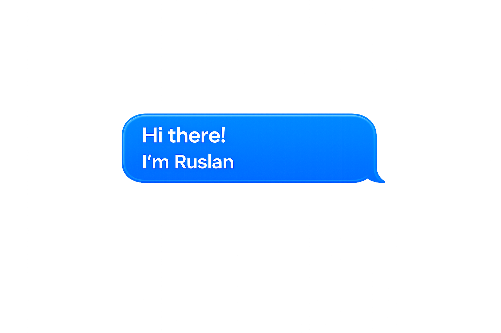

 
 

<ul>
  <li> 🏫 College student at Ushakov State Maritime University (Novorossiysk).</li>
  <li> 💻 Software development is part of my everyday life and a way to keep learning and improving through practice.</li>
  <li> 🌕I’m interested in understanding how complex systems are built and how they work under the hood.</li>
</ul>

<h2 align="center">🛠 Tech Stack</h2>

  
  &nbsp;&nbsp;&nbsp;
  
  &nbsp;&nbsp;&nbsp;
  
  &nbsp;&nbsp;&nbsp;
  
  &nbsp;&nbsp;&nbsp;
  
  &nbsp;&nbsp;&nbsp;
  
  &nbsp;&nbsp;&nbsp;
  
  &nbsp;&nbsp;&nbsp;
  
  &nbsp;&nbsp;&nbsp;

<h3 align="center">🌱 Familiar With </h3>

  

   
  
  <h2 align="center">🔗 My contacts</h2>
  

    
    
    
  

